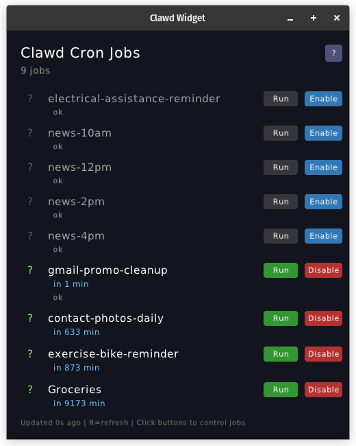

# 🕵️ Clawd Widget

A lightweight desktop widget for monitoring [Clawdbot](https://github.com/clawdbot/clawdbot) cron jobs in real-time.

Built with **Zig + Raylib** for maximum performance and minimal footprint.



## ✨ Features

- 🎯 **Live Cron Job Monitoring** - See all your Clawdbot scheduled tasks at a glance
- ⏱️ **Next Run Countdown** - Know exactly when each job will execute
- 🔄 **Auto-Refresh** - Updates every 30 seconds (or press `R` to refresh manually)
- 🎮 **Job Controls** - Run, Stop, or Start jobs directly from the widget
- 📄 **Status Tooltips** - Hover over jobs to see status file contents (word-wrapped)
- 🎨 **Dark Theme UI** - Easy on the eyes with color-coded status indicators
- 📏 **Resizable Window** - Adjust to fit your workflow
- 🪶 **Tiny Binary** - Under 1MB with zero dependencies
- 🚀 **Fast Startup** - Native executable, no runtime required

## 📋 Requirements

- **Clawdbot Gateway** running locally (default: `localhost:18789`)
- **Zig 0.16+** (for building from source)
- **Linux** (primary target; Windows/Mac support planned)

## 🔧 Installation

### From Source

```bash
# Clone the repository
git clone <your-repo-url>
cd clawd-widget

# Build
zig build -Doptimize=ReleaseSmall

# Run
./zig-out/bin/clawd-widget
```

### Requirements for Building

The widget automatically vendors Raylib, but you'll need system libraries:

**Linux:**
```bash
# Debian/Ubuntu
sudo apt install libgl1-mesa-dev libx11-dev

# Fedora
sudo dnf install mesa-libGL-devel libX11-devel

# Arch
sudo pacman -S mesa libx11
```

## 🎮 Usage

Just run the binary:

```bash
./clawd-widget
```

The widget automatically:
1. Reads your Clawdbot config from `~/.clawdbot/clawdbot.json`
2. Connects to the gateway using your configured auth token
3. Displays all active cron jobs with countdown timers

### Command Line Options

```
Usage: clawd-widget [OPTIONS]

Options:
  -c, --config <path>      Path to clawdbot config file
                           (default: ~/.clawdbot/clawdbot.json)
  -s, --status-dir <path>  Directory for job status files
                           (default: ~/clawd/cron-status)
  -d, --debug              Print API calls to stderr
  -h, --help               Show help message
```

**Examples:**
```bash
# Use default paths
./clawd-widget

# Custom config location
./clawd-widget -c /path/to/clawdbot.json

# Custom status directory
./clawd-widget -s /path/to/status-files
```

### Controls

- **R** - Manual refresh
- **Run** button - Execute job immediately (force runs even if not due)
- **Enable/Disable** button - Toggle job enabled state
- **Hover job name** - View status file preview (if exists)
- **ESC** - Close window (or click the X)

### Status Files

Jobs can write status information to markdown files that the widget displays as tooltips:

```
~/clawd/cron-status/[job-id].md
```

Hover over a job name to see the status file contents (with word-wrap).

## 🏗️ Architecture

```
clawd-widget
├── src/
│   └── main.zig          # Main application logic
├── vendor/
│   └── raylib/           # Vendored Raylib (built from source)
└── build.zig             # Zig build configuration
```

### How It Works

1. **Config Loading** - Reads `~/.clawdbot/clawdbot.json` for gateway port and auth token
2. **HTTP Request** - Calls `POST /tools/invoke` with `{"tool": "cron", "action": "list"}`
3. **JSON Parsing** - Extracts job names, status, and timing info
4. **Rendering** - Displays in a native Raylib window with live countdown

No polling the filesystem. No heavy frameworks. Just direct API calls.

## 🎨 Customization

**Background Images** (planned):
```bash
mkdir -p ~/.clawdbot/widget
cp your-bg.png ~/.clawdbot/widget/background.png
```

**Future Config Options:**
- Refresh interval
- Window size/position
- Color themes
- Font selection

## 🔨 Development

### Project Status

⚠️ **Early WIP** - Expect rough edges!

Current features:
- ✅ Live cron job display
- ✅ Auto-refresh
- ✅ Resizable window
- ✅ Manual refresh (R key)
- ✅ Run/Stop/Start job buttons
- ✅ Status file tooltips with word-wrap
- ✅ CLI options for custom paths

Planned:
- 🔲 System tray integration
- 🔲 Settings UI
- 🔲 Custom backgrounds
- 🔲 Windows/Mac builds
- 🔲 Click to open Clawdbot web UI
- ✅ Job action buttons (Run now / Stop / Start)

### Building Tips

**Size Optimization:**
```bash
# Smallest possible build
zig build -Doptimize=ReleaseSmall
strip zig-out/bin/clawd-widget
```

**Debug Build:**
```bash
zig build
```

**Run Tests** (when implemented):
```bash
zig build test
```

## 🤝 Contributing

Contributions welcome! This is a learning project and a useful tool.

**Ideas for PRs:**
- Cross-platform support (Windows/Mac)
- System tray mode
- Config file for widget settings
- Click handlers for job actions
- Better error handling
- Unit tests

## 📝 License

[Choose your license - MIT recommended for widgets]

## 🙏 Credits

- Built with [Zig](https://ziglang.org/)
- UI powered by [Raylib](https://www.raylib.com/)
- Made for [Clawdbot](https://github.com/clawdbot/clawdbot)

---

**Binary Size:** <1MB | **Startup:** <100ms | **Memory:** ~10MB | **Dependencies:** 0

*Because desktop widgets shouldn't be 100MB Electron apps.*
